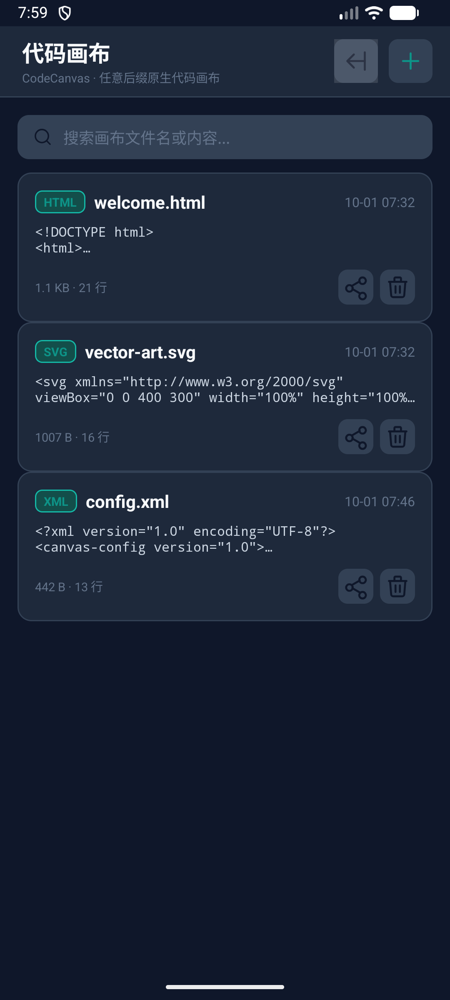
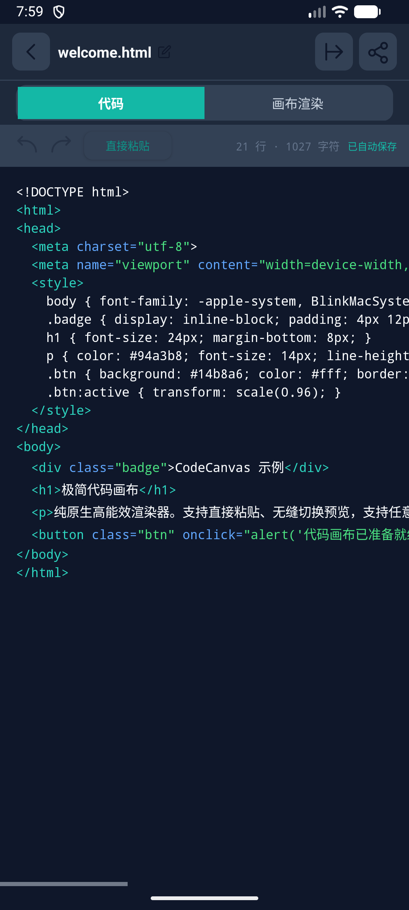
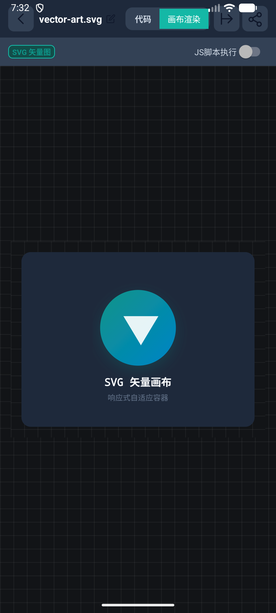
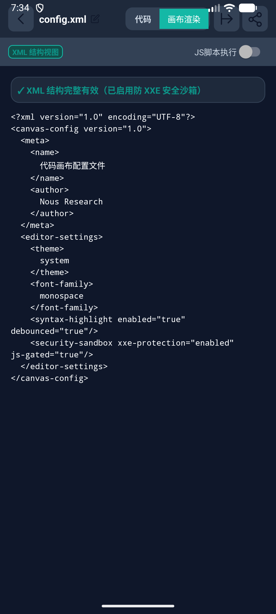

# CodeCanvas (代码画布)

> 纯原生、极简、高能效的 Android 代码画布与本地即时渲染器。零第三方臃肿框架依赖，单手自适应布局，专注 HTML5 / SVG / XML 源码调试与可视化呈现。

[](https://github.com/zhuquan7237/code-canvas/actions)
[](LICENSE)
[](app/build.gradle.kts)
[](app/build.gradle.kts)

---

## 🌟 核心特性与设计哲学

- **极致轻量无负担**：仅依靠 Android 官方标准 SDK 原生组件构建，全 Release 安装包体积仅约 **40 KB**（开启 R8 代码混淆与资源缩减）。
- **任意文件后缀支持**：支持以任意自定义扩展名（如 `.html`, `.svg`, `.xml`, `.shader.glsl`, `.custom`）保存并管理画布。
- **现代化 Edge-to-Edge 视觉适配**：全面适配 Android 15 (Target SDK 35) 全面屏边缘延伸与沉浸式状态栏/导航栏 `WindowInsets` 安全区，杜绝刘海屏与系统状态栏遮挡。
- **分层工具栏与全宽 Tab**：顶栏精简为操作与重命名区，视图切换（代码 / 画布渲染）独立成全宽分段 Tab 行，保证触控命中率与小屏显示完整性。
- **即时安全沙箱渲染**：
  - **HTML5 渲染**：开箱即用，默认关闭 JavaScript 执行与文件系统穿透，提供独立开关门禁保护。
  - **SVG 矢量画布**：自动注入响应式视口包装，适配深浅色模式与矢量缩放。
  - **普通 XML 树形与安全解析（重要诚实说明）**：
    - ✅ **纯普通 XML 数据结构格式化与语法有效性校验**。
    - ✅ **SAX / DOM 防御 XXE (XML External Entity) 注入反欺骗沙箱**。
    - ⚠️ **本应用明确不支持 XSL/XSLT 样式表转换与高级 XML 模板引擎**，仅提供普通 XML 语法校验、节点层级展示与错误即时定位。
- **剪贴板快捷粘贴与代码防爆保护**：
  - 提供单键直接粘贴剪贴板源码能力。
  - 设置 **2MB** 内存与导入上限，带有清晰拦截与错误提示，避免系统 Binder Transaction 崩溃及卡顿。
- **完善的撤销/重做与原子落盘**：
  - 内存级快照支持撤销与重做。
  - 单线程串行执行器搭配不可变快照（`snapshot()`）持久化，消除后台并发保存时数据竞态冲突与脏写。
- **隐私与系统集成**：支持通过 SAF (Storage Access Framework) 系统选择器导入导出，支持 Content Provider 安全分享。

---

## 📐 页面架构与截图

### 1. 画布管理主屏 (`MainActivity`)
提供画布快速检索、实时字数/大小统计、标签展示、快速分享/删除以及新建画布入口。



### 2. 代码编辑器与全宽分段 Tab (`EditorActivity`)
拥有防遮挡的安全区内边距、撤销/重做操作条、剪贴板一键粘贴，以及独立分行的分段切换 Tab。



### 3. SVG 矢量自适应渲染
自动识别 `.svg` 后缀或 SVG 标签，以自适应容器呈现高质量矢量图。



### 4. XML 结构与语法校验视图
普通 XML 代码的结构化高亮、层级解析与 XXE 安全沙箱拦截结果。



---

## 🛠️ 构建与测试运行

### 前置要求
- JDK 17
- Android SDK（API Level 35；本机验证使用 Build Tools 36.0.0）

### 1. 运行本地单元测试
```bash
./gradlew testDebugUnitTest
```

### 2. 运行真机/模拟器完整 E2E 仪器测试
包含新建任意后缀文件、剪贴板粘贴、编辑、撤销重做、保存退出重开、WebView DOM 注入求值与 JS 门禁测试、XML 语法错误拦截等全流程用例：
```bash
./gradlew connectedDebugAndroidTest
```

### 3. 构建发布版 APK
签名配置遵循外置 `signing.properties`（已加入 `.gitignore` 防止密钥泄露）：
```properties
storeFile=path/to/your-keystore.jks
storePassword=your_store_password
keyAlias=your_key_alias
keyPassword=your_key_password
```
执行编译：
```bash
./gradlew assembleRelease
```
产物位置：`app/build/outputs/apk/release/app-release.apk`

---

## 📄 开源许可证

本项目采用 [MIT License](LICENSE) 授权许可。
