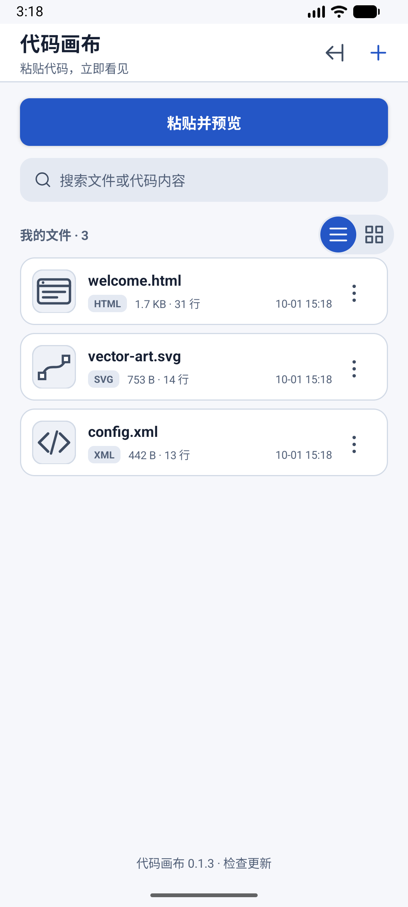
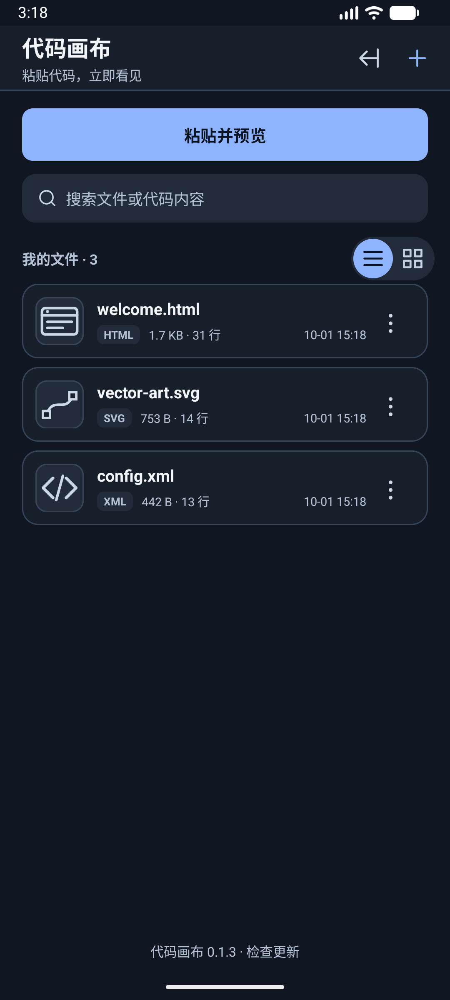
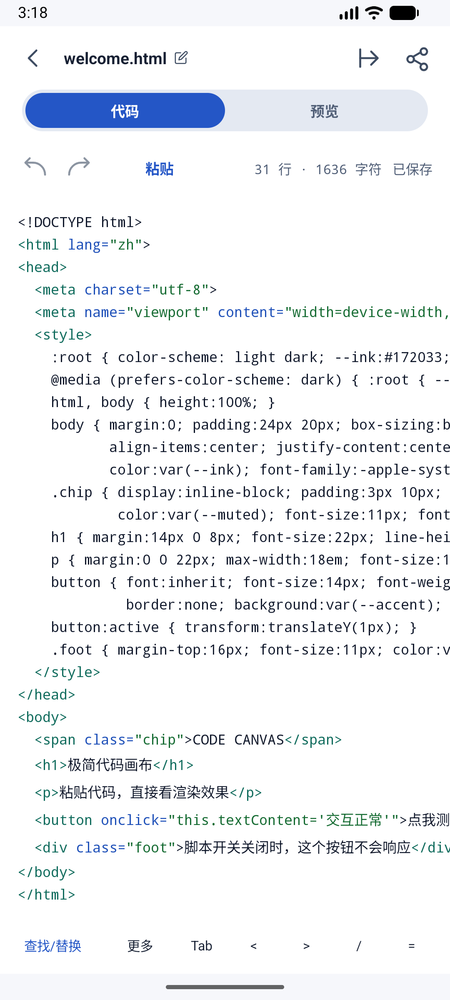
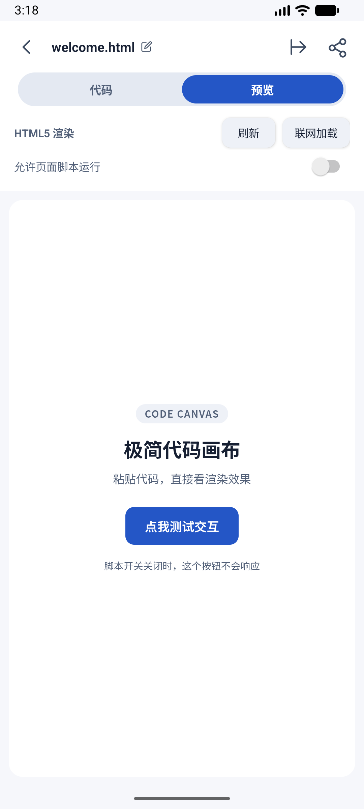
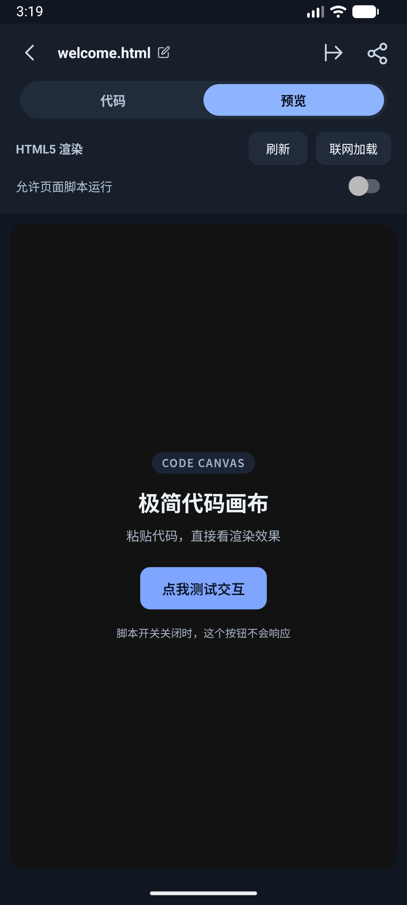
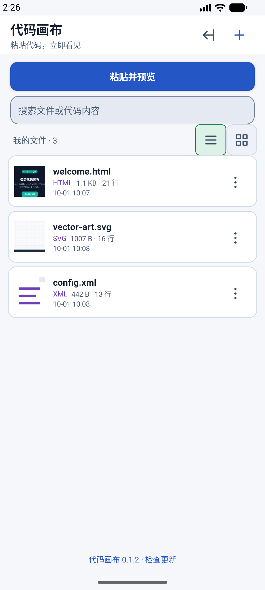
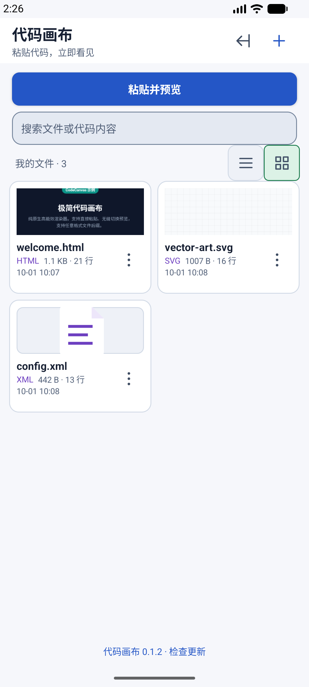
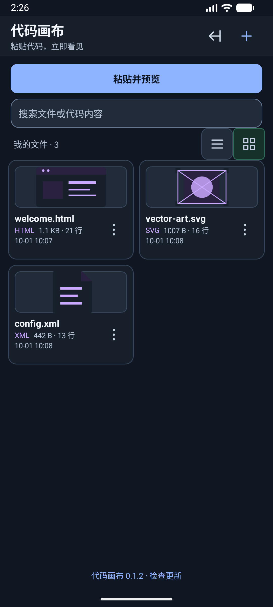
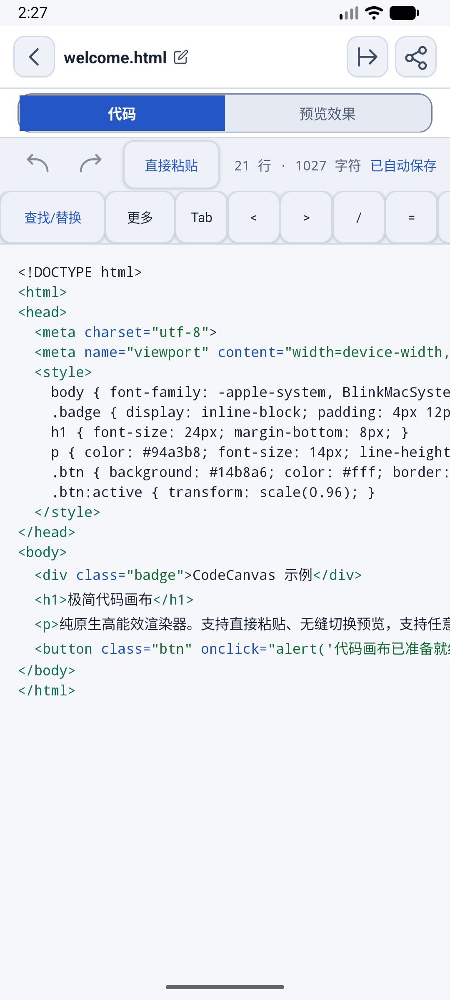
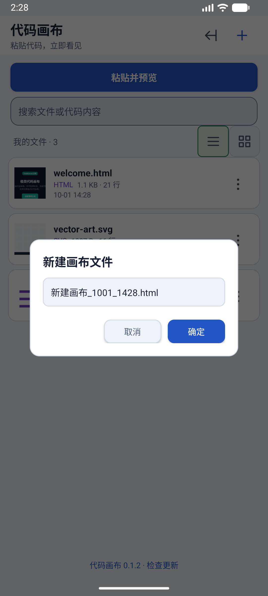

# 代码画布 · CodeCanvas

把 AI 给出的代码，变成看得见的作品。轻量原生 Android 应用，使用系统 WebView，不打包浏览器内核。

[下载最新 APK](https://github.com/zhuquan7237/code-canvas/releases/latest) · [构建状态](https://github.com/zhuquan7237/code-canvas/actions) · [验收与边界](docs/VERIFICATION.md)

## 怎么用

1. 在 AI 聊天里复制 HTML、SVG 或 XML 代码。
2. 点 **粘贴并预览**，不必先理解文件后缀。
3. 多段代码分别选择，不擅自拼接 HTML/CSS/JS。
4. 点作品名称重命名；导出为标准文件，其他编辑器和浏览器也能使用。

已有作品默认打开预览，需要修改时再切「代码」。空白新建仍直接编辑。主页不显示代码片段；打开 HTML/SVG 预览后缓存真实封面，下次回主页更容易认出作品。封面为预览首屏而非实时网页，修改或切换主题后旧封面失效，临时缓存最多 40 张，系统可清理。

## v0.1.1 打磨

- 修复命名/重命名黑底黑字：主题、输入框、提示、按钮统一适配深浅色。
- 首页突出「粘贴并预览」，隐藏源码片段；作品点开先看效果。
- 提取 AI 回复的 Markdown 代码块，支持多段选择和保留原文；不拆源码内部的 Markdown 示例。
- 粘贴到已有作品时选择追加或覆盖，覆盖可撤销；语法高亮保留完整选区。
- 预览支持刷新；长按「代码」标签复制全部源码。
- 对 CDN、缺失本地资源、需要编译的代码给出持续可读的说明。
- 保存使用不可变快照与原子替换，多页面并发不丢其他作品；清空作品后不再自动出现示例。

## v0.1.3 本次更新（界面重做）

**这一版不加功能，只修"上一版界面根本不能交付"这件事。**

上一版的验收只对了对比度数值、测试全绿和不崩溃——那是无障碍与功能验收，不是画面验收。把模拟器真实画面逐屏看下来，一堆问题：白底工具栏直接硬切到近黑画布、内置示例内容挤在顶部而下面七成是死空、每个图标被一圈灰方框包着、一屏里蓝/薄荷绿/紫色各自抢焦点、蓝色版本号常驻主页底部。这些测试一条都测不到。

- **内置示例重做**：原来是青绿 + 近黑、内容挤顶、下方大片空白。现在是垂直居中的极简页，浅色/深色各自适配，只用**一个**强调色；文案缩短到一行不再孤字折行；示例里直接写明"脚本开关关闭时按钮不会响应"，不再自相矛盾。
- **预览画布**：由顶到屏幕边缘的深色块改为**落在浅色底上的圆角卡片**，底色跟随主题——白 chrome 与画布之间不再生硬硬切。
- **统一细线条语言**：顶栏 / 工具栏 / 卡片上的图标**全部去掉灰色描边框**，只在按下时出现浅色底；分段控件选中态由"方角纯色块"改为 999 圆角胶囊（原来那方块必然溢出圆角轨道）；主页视图切换由薄荷绿方框改为浅轨道里的蓝色胶囊。
- **主页**：搜索框补上放大镜、去掉常驻描边（只在获得焦点时描边）；文件类型标签去掉紫色改中性；卡片信息从三行压成两行；底部版本号从蓝色大字改为安静的中性灰小字，**只有真的发现新版本才变主色**。
- **文件图标重画**：三个类型的封面改为单色线性图形（浏览器窗口 / 贝塞尔曲线 / 尖括号）——原来三个都是紫色，其中一个几乎看不见。缩略图加了一层 foreground 描边，避免白底页面渲染图把边框盖掉、看起来像图标丢了。
- **编辑器**：符号条移到底部（键盘弹出时正好在键盘上方），不再白占顶部一行，并加横向渐隐提示；撤销/重做/粘贴统一为无框样式，"已自动保存"由鲜绿改中性灰。
- 验证：单元测试 47 项、模拟器仪器测试 20 项全部通过，另按浅色/夜间逐屏截图复核（见[截图](#截图)）。

## v0.1.2 更新

- **颜色系统重做**：深浅色各自一套完整调色板，正文/次要文字/图标/状态色按 WCAG 2.1 AA 真机实测（正文 ≥4.5:1，功能图标与描边 ≥3:1）。修掉了「文字和背景颜色差不多」的老问题；禁用态按钮改为浅灰底 + 深灰字，不再出现白字压在浅灰底上看不清。
- **主页可切布局**：紧凑列表（默认）/ 两列方格，选择会记住。列表一行约 76dp，一屏能看到 6 个以上文件；卡片右上角「⋮」集中放编辑 / 分享 / 删除，方格模式曾一进主页就崩溃，本版已修。
- **代码 / 预览不再白屏闪**：内容没变就不重新加载 WebView，渲染完成后才撤掉加载遮罩，切换用 160ms 位移过渡并遵守系统「关闭动画」设置；加载超时 15 秒会给出提示而不是一直遮着。
- **编辑器工具栏**：撤销 / 重做 / 直接粘贴，加一条可横向滑动的常用符号条（Tab、`<`、`>`、`/`、`=`、`"`、`{}`、`()`、`[]`，配对符号把光标留在中间），以及查找/替换（上一处、下一处、替换、全部替换，可撤销）和「更多」（全选、复制全部代码、跳转到行）。
- **应用内检查更新**：默认每 6 小时静默检查（可在「检查更新」上长按关闭），主页底部入口显示已装版本和检查结果。下载前需你确认；下载后校验大小、SHA-256、包名与签名一致，才交给系统安装器。**0.1.1 没有更新器，需要手动安装一次。**
- 验证：JVM 单元测试 47 项、模拟器仪器测试 20 项全部通过。

## 功能与边界

- 新建、任意后缀、重命名、搜索、自动保存、粘贴、撤销/重做、系统文件导入导出与分享。
- HTML/SVG 可视化渲染，普通 XML 提供格式化文本、语法校验与防 XXE。
- JavaScript 与网络加载默认关闭。需要按钮/动画时开启「启用交互」；需要 HTTPS 图片或 CDN 时点「联网加载」并确认，仅对当前页面生效。不开放本地文件访问，HTTP 明文资源不支持。只开启你信任的代码。
- 不包含 Vue/React 编译器、Node.js、Python 或 XSLT。请让 AI 提供「单个自包含 HTML 文件，CSS/JS 内嵌，不依赖 CDN」。
- 相对路径图片、CSS、JS 不会靠粘贴自动补齐；需要内嵌资源或可访问链接。
- 文件导入上限 2MB，超大剪贴板有明确提示；大文件性能不作为本版保证范围。
- Android 8.0+，需要系统 WebView；厂商输入法和动画体验待实机反馈。

## 构建

JDK 17、Android SDK API 35。Windows 使用 `gradlew.bat`，Linux/macOS 使用 `./gradlew`。

```sh
./gradlew testDebugUnitTest
./gradlew connectedDebugAndroidTest
./gradlew assembleRelease
```

签名由未跟踪的 `signing.properties` 或环境变量提供，密钥、密码和本机配置不会发布。

```properties
storeFile=/path/to/your-keystore.jks
storePassword=your_password
keyAlias=your_alias
keyPassword=your_password
```

## 发布（维护者）

应用内「检查更新」读的是 `docs/update/latest.json`（原始地址 + GitHub Release API 兜底）。**清单里的哈希、大小、URL 必须来自真实已上传的 APK**，顺序不能颠倒：

1. 升 `app/build.gradle.kts` 的 `versionName` / `versionCode`。
2. `./gradlew testDebugUnitTest assembleRelease`，单元测试必须全绿。
3. 打 tag 并建 GitHub Release，上传 `app/build/outputs/apk/release/app-release.apk`。
4. 生成清单并提交推送：
   ```sh
   python scripts/release.py --apk app/build/outputs/apk/release/app-release.apk \
     --version-name 0.1.3 --version-code 4 --tag v0.1.3 \
     --notes "本次更新内容…"
   ```
   脚本从文件本身算 SHA-256 与字节数，不接受手填；`latest.json` 只有正向递增的 `versionCode` 才会被应用接受。

## 截图

v0.1.3（[全部截图](docs/evidence/v0.1.3/)）：







v0.1.2（[全部截图](docs/evidence/v0.1.2/)）：







v0.1.1：


MIT License。

