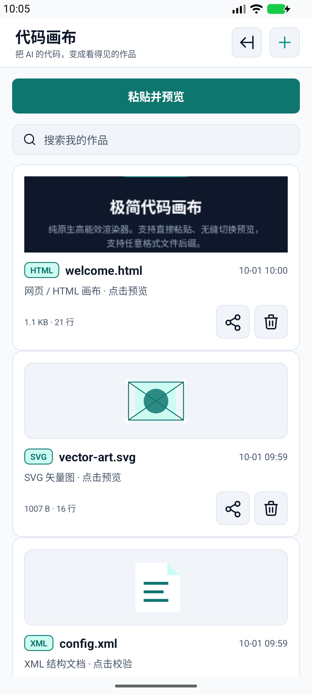
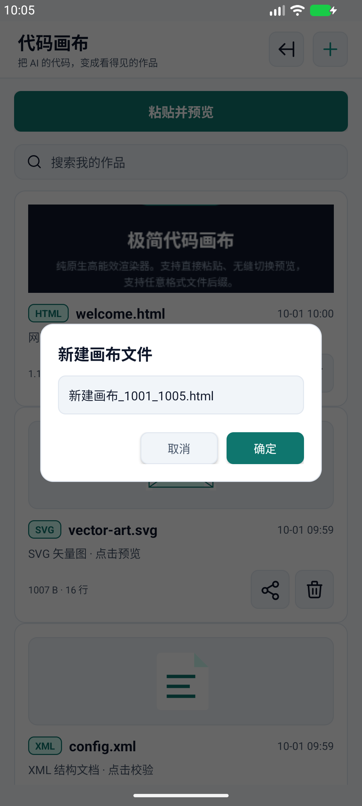
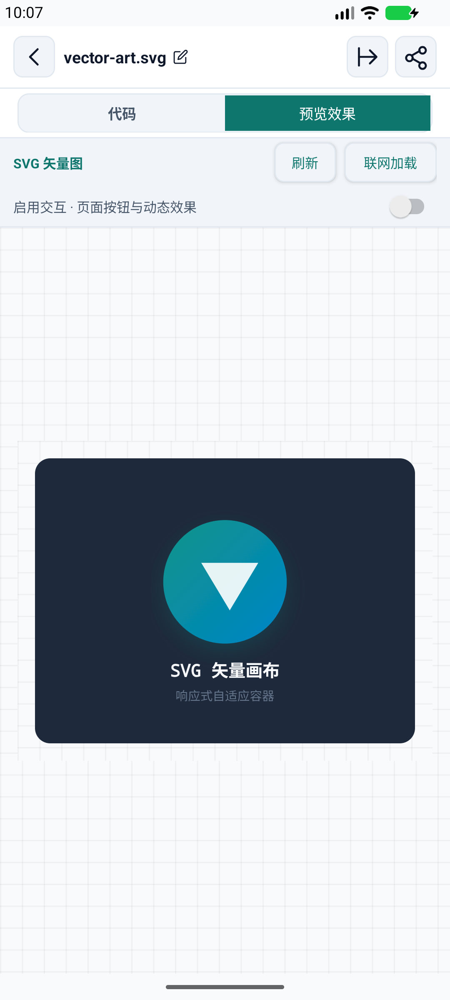

# 代码画布 · CodeCanvas

把 AI 给出的代码，变成看得见的作品。轻量原生 Android 应用，使用系统 WebView，不打包浏览器内核。

[下载最新 APK](https://github.com/zhuquan7237/code-canvas/releases/latest) · [构建状态](https://github.com/zhuquan7237/code-canvas/actions) · [验收与边界](docs/VERIFICATION.md)

## 怎么用

1. 在 AI 聊天里复制 HTML、SVG 或 XML 代码。
2. 点 **粘贴并预览**，不必先理解文件后缀。
3. 多段代码分别选择，不擅自拼接 HTML/CSS/JS。
4. 点作品名称重命名；导出为标准文件，其他编辑器和浏览器也能使用。

已有作品默认打开预览，需要修改时再切「代码」。空白新建仍直接编辑。主页不显示代码片段；打开 HTML/SVG 预览后缓存真实封面，下次回主页更容易认出作品。封面为预览首屏而非实时网页，修改或切换主题后旧封面失效，临时缓存最多 40 张，系统可清理。

## v0.1.1 打磨

- 修复命名/重命名黑底黑字：主题、输入框、提示、按钮统一适配深浅色。
- 首页突出「粘贴并预览」，隐藏源码片段；作品点开先看效果。
- 提取 AI 回复的 Markdown 代码块，支持多段选择和保留原文；不拆源码内部的 Markdown 示例。
- 粘贴到已有作品时选择追加或覆盖，覆盖可撤销；语法高亮保留完整选区。
- 预览支持刷新；长按「代码」标签复制全部源码。
- 对 CDN、缺失本地资源、需要编译的代码给出持续可读的说明。
- 保存使用不可变快照与原子替换，多页面并发不丢其他作品；清空作品后不再自动出现示例。

## 功能与边界

- 新建、任意后缀、重命名、搜索、自动保存、粘贴、撤销/重做、系统文件导入导出与分享。
- HTML/SVG 可视化渲染，普通 XML 提供格式化文本、语法校验与防 XXE。
- JavaScript 与网络加载默认关闭。需要按钮/动画时开启「启用交互」；需要 HTTPS 图片或 CDN 时点「联网加载」并确认，仅对当前页面生效。不开放本地文件访问，HTTP 明文资源不支持。只开启你信任的代码。
- 不包含 Vue/React 编译器、Node.js、Python 或 XSLT。请让 AI 提供「单个自包含 HTML 文件，CSS/JS 内嵌，不依赖 CDN」。
- 相对路径图片、CSS、JS 不会靠粘贴自动补齐；需要内嵌资源或可访问链接。
- 文件导入上限 2MB，超大剪贴板有明确提示；大文件性能不作为本版保证范围。
- Android 8.0+，需要系统 WebView；厂商输入法和动画体验待实机反馈。

## 构建

JDK 17、Android SDK API 35。Windows 使用 `gradlew.bat`，Linux/macOS 使用 `./gradlew`。

```sh
./gradlew testDebugUnitTest
./gradlew connectedDebugAndroidTest
./gradlew assembleRelease
```

签名由未跟踪的 `signing.properties` 或环境变量提供，密钥、密码和本机配置不会发布。

```properties
storeFile=/path/to/your-keystore.jks
storePassword=your_password
keyAlias=your_alias
keyPassword=your_password
```

## 截图





MIT License。

